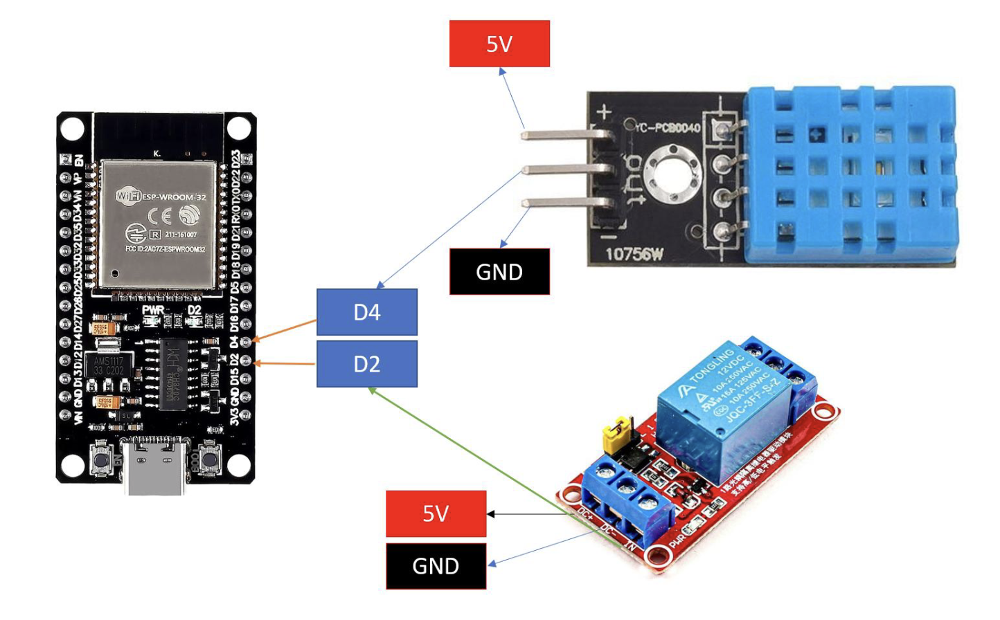
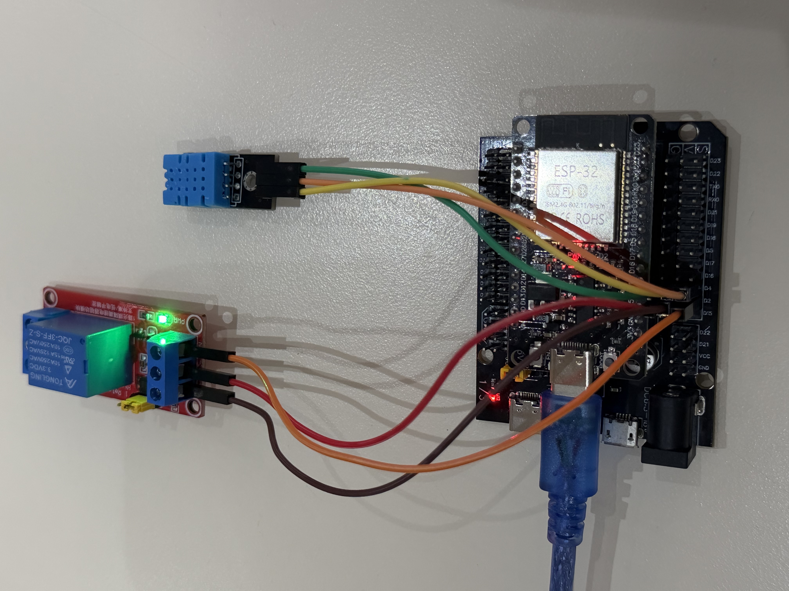
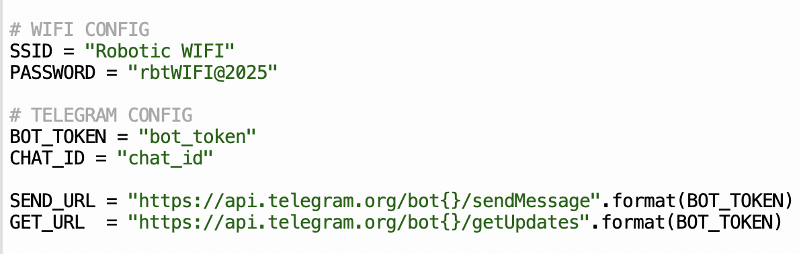
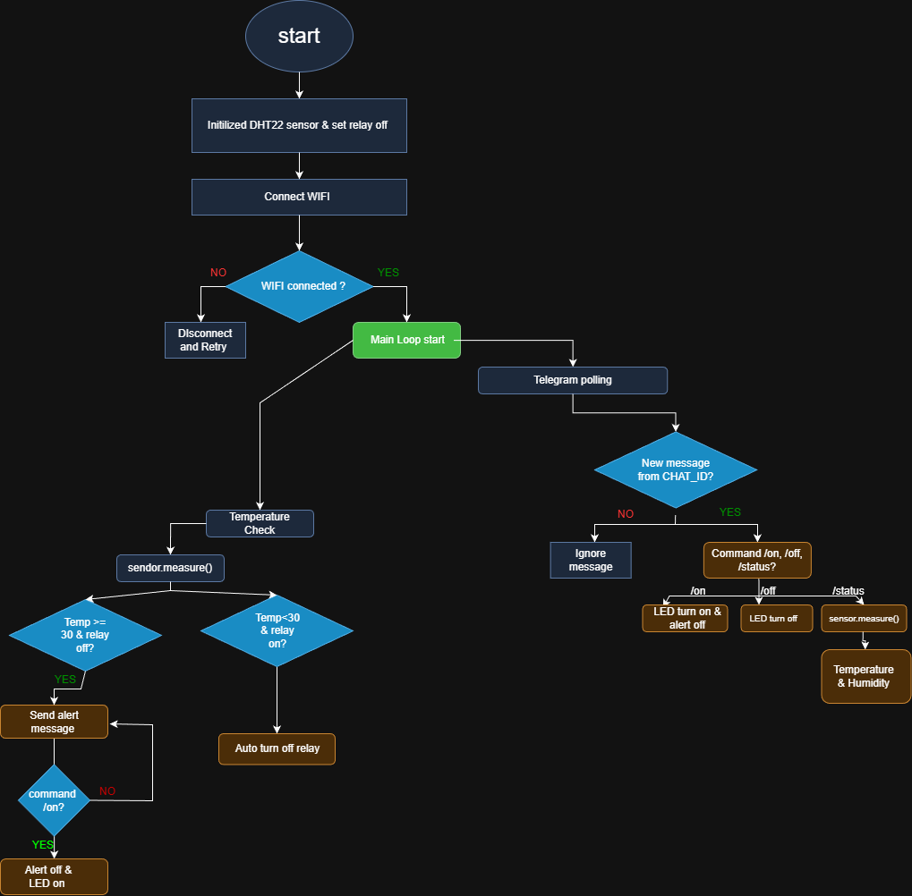

# _IoT Lab Tasks – DHT22 & Telegram Bot_

## Wiring

# Configuration

## Task 1: Sensor Read & Print

- Read **DHT22** sensor data every **5 seconds**.
- Print **temperature** and **humidity** values with **2 decimal places**.
  

## Task 2: Telegram Send

- Implement the `send_message()` function.
- Send a **test message** to the Telegram group.

  
  

## Task 3: Bot Commands

- Implement `/status` command to reply with:
  - Current **temperature**
  - Current **humidity**
  - **Relay state**
- Implement `/on` and `/off` commands to control the relay.

  

## Task 4: Temperature Alert Logic

- No alert messages while **temperature < 30°C**.
- If **temperature ≥ 30°C** and **relay is OFF**:
  - Send an alert **every loop (5 seconds)** until `/on` is received.
- After receiving `/on`:
  - Stop sending alerts.
- When **temperature < 30°C**:

  - Automatically turn the relay **OFF**.
  - Send a **one-time "auto-OFF"** notification.

  ## Flowchart

  

  ## Video Demo

  [Click here to view demo video](https://youtu.be/qg2fIZ6nbvY)
