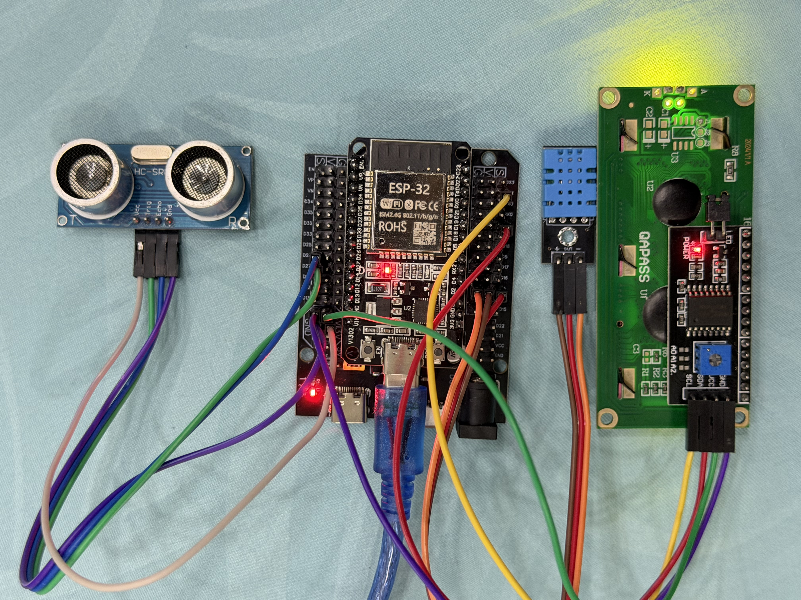

# _IoT Lab Tasks – DHT22 & Telegram Bot_

## Wiring

# Configuration

## Task 1: LED Control

- Add two buttons (ON/OFF) on the web page.
- When clicked, LED on GPIO2 should turn ON or OFF.

  [Task 1 demo video](https://youtu.be/OJNT5pVNWLQ)

## Task 2 - Sensor Read

- Read DHT11 temperature and ultrasonic distance.
- Show values on the web page (refresh every 1-2 seconds).

## Task 3 - Sensor → LCD

- Add two buttons:
    - Show Distance → writes distance to LCD line 1.
    - Show Temp → writes temperature to LCD line 2.

[Task 3 demo video](https://youtu.be/OJNT5pVNWLQ)

## Task 4 - Textbox → LCD

- Add a textbox + “Send” button on the web page.
- User enters custom text → LCD displays it (scroll if >16 chars).

