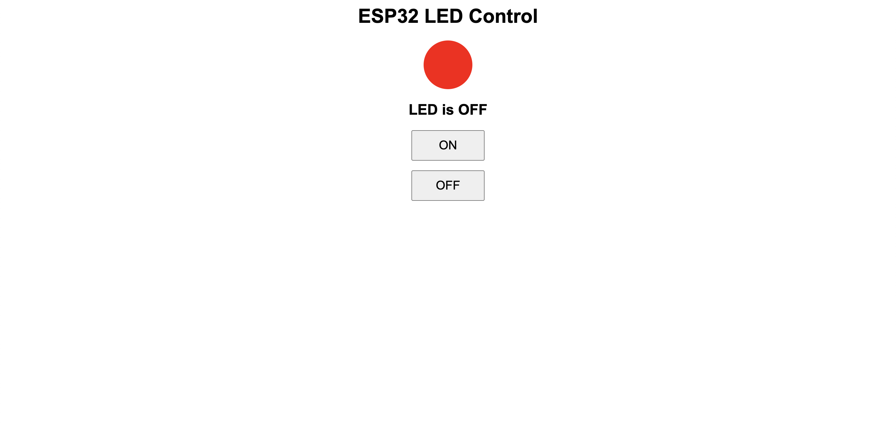
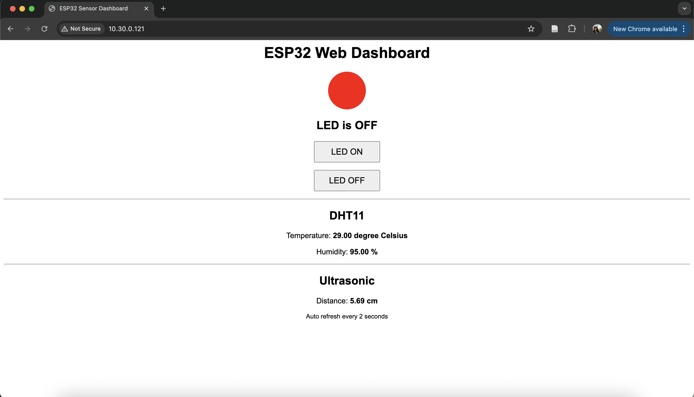
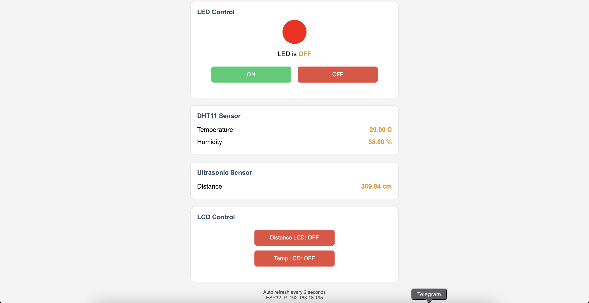
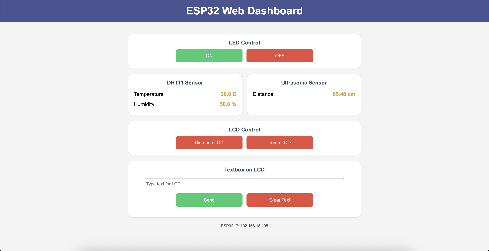

# _IoT Lab Tasks – DHT22 & Telegram Bot_

## Wiring


## Setup Instructions

1. Flash MicroPython firmware to the ESP32.
2. Open the project in Thonny.
3. Save these 2 files (in lcd_hepers folder) to Micropython (to the ESP32):
   - machine_i2c_lcd.py
   - lcd_api.py
4. Update Wi-Fi credentials in `main.py`:
   ```python
   ssid = "YOUR_WIFI_NAME"
   password = "YOUR_WIFI_PASSWORD"
   ```

## Task 1: LED Control

- Add two buttons (ON/OFF) on the web page.
- When clicked, LED on GPIO2 should turn ON or OFF.


[Task 1 demo video](https://youtu.be/OJNT5pVNWLQ)

## Task 2 - Sensor Read

- Read DHT11 temperature and ultrasonic distance.
- Show values on the web page (refresh every 1-2 seconds).


[Task 2 demo video](https://youtu.be/TLuxZOYA5pc)

## Task 3 - Sensor → LCD

- Add two buttons:
  - Show Distance → writes distance to LCD line 1.
  - Show Temp → writes temperature to LCD line 2.


[Task 3 demo video](https://youtu.be/veYvt8ouOZ8)

## Task 4 - Textbox → LCD

- Add a textbox + “Send” button on the web page.
- User enters custom text → LCD displays it (scroll if >16 chars).


[Task 4 demo video](https://youtu.be/ZjfcHdFhzK0)
