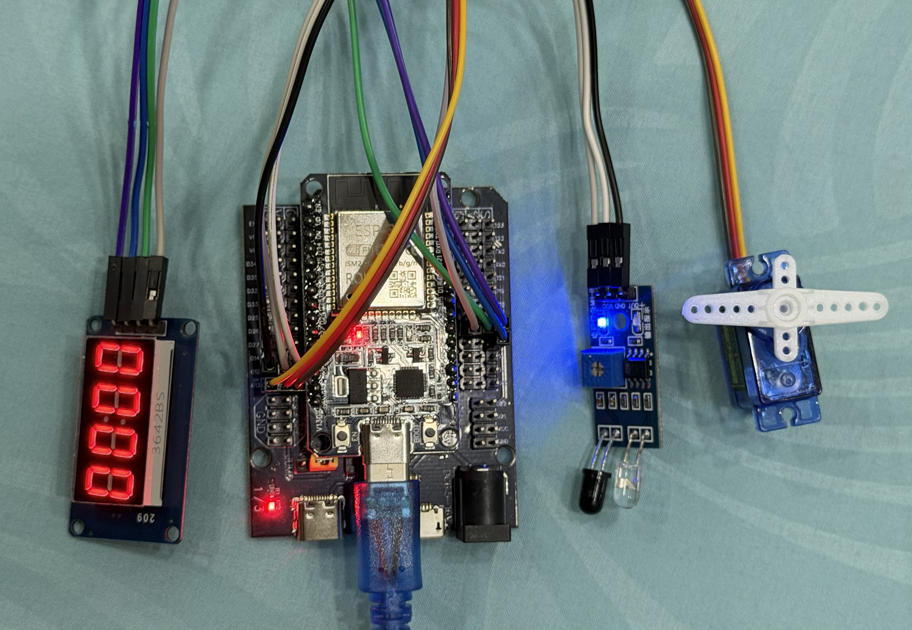
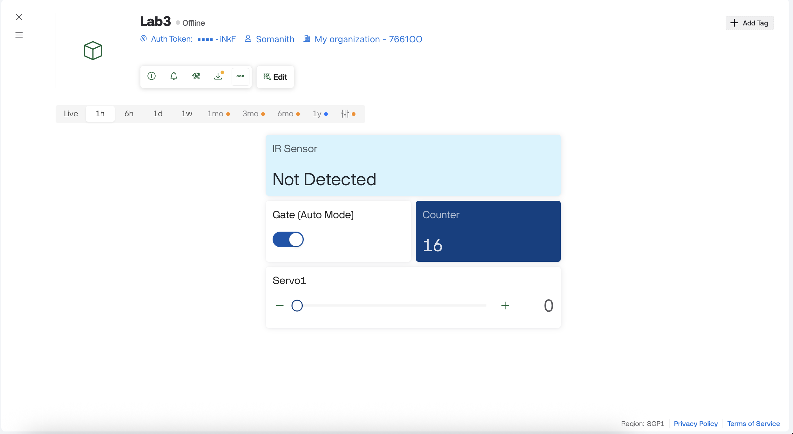

# LAB3_IoT_Blynk_IR_Servo_TM1637

## Wiring




## Setup and Usage Instructions

### + Add Widgets in Dashboard

- IR Status: Label → V0 (String)
- Servo Control: Slider → V2 (Integer 0-180)
- Counter: Lebel → V3 (Integer)
- Mode Control: Switch → V4 (Integer)

### + Code Setup

This project uses 2 files:

- main.py
- tm1637.py (Display Driver)

  ```python
  from machine import Pin
  from time import sleep_us

  # TM1637 commands
  CMD_DATA = 0x40      # auto increment
  CMD_ADDR = 0xC0      # start address
  CMD_CTRL = 0x80      # display control

  # Digit to 7-segment mapping (0–9)
  SEGMENTS = [
      0x3F,  # 0
      0x06,  # 1
      0x5B,  # 2
      0x4F,  # 3
      0x66,  # 4
      0x6D,  # 5
      0x7D,  # 6
      0x07,  # 7
      0x7F,  # 8
      0x6F   # 9
  ]

  class TM1637:
      def __init__(self, clk_pin, dio_pin, brightness=7):
          self.clk = Pin(clk_pin, Pin.OUT, value=1)
          self.dio = Pin(dio_pin, Pin.OUT, value=1)
          self.brightness = brightness
          self._update_display()

      # ---------- Low-level protocol ----------
      def _start(self):
          self.dio.value(0)
          sleep_us(10)
          self.clk.value(0)

      def _stop(self):
          self.clk.value(1)
          sleep_us(10)
          self.dio.value(1)

      def _write_byte(self, data):
          for i in range(8):
              self.dio.value(data & 0x01)
              data >>= 1
              self.clk.value(1)
              sleep_us(10)
              self.clk.value(0)
          # ignore ACK
          self.clk.value(1)
          sleep_us(10)
          self.clk.value(0)

      # ---------- Display control ----------
      def _update_display(self):
          self._start()
          self._write_byte(CMD_CTRL | 0x08 | self.brightness)
          self._stop()

      def set_brightness(self, value):
          self.brightness = max(0, min(value, 7))
          self._update_display()

      # ---------- High-level function ----------
      def show_number(self, num):
          num = max(0, min(num, 9999))
          digits = [
              num // 1000 % 10,
              num // 100 % 10,
              num // 10 % 10,
              num % 10
          ]

          self._start()
          self._write_byte(CMD_DATA)
          self._stop()

          self._start()
          self._write_byte(CMD_ADDR)
          for d in digits:
              self._write_byte(SEGMENTS[d])
          self._stop()

          self._update_display()
      def show_digit(self, num):
          """
          Display number (0–9999) with NO leading zeros.
          Unused digits are blank.
          Examples:
            show_digit(4)    ->    '   4'
            show_digit(12)   ->    '  12'
            show_digit(123)  ->    ' 123'
            show_digit(1234) ->    '1234'
          """
          if not 0 <= num <= 9999:
              return

          s = str(num)                  # convert number to string
          data = [0x00, 0x00, 0x00, 0x00]  # blank display

          start = 4 - len(s)            # right alignment
          for i, ch in enumerate(s):
              data[start + i] = SEGMENTS[int(ch)]

          # send data to TM1637
          self._start()
          self._write_byte(CMD_DATA)
          self._stop()

          self._start()
          self._write_byte(CMD_ADDR)
          for seg in data:
              self._write_byte(seg)
          self._stop()

          self._update_display()
  ```

## Task 1 – IR Sensor Reading

- Read IR sensor digital output using ESP32.
- Display IR status (Detected / Not Detected) on Blynk.
- Evidence: Screenshot of Blynk showing IR status.

[Task 1 demo video](https://youtu.be/2fcf_426CCw?si=SaaoB3swGQb_jFPO)

## Task 2 – Servo Motor Control via Blynk

- Add a Blynk Slider widget to control servo position.
- Slider position from 0 to 180 degree and the servo is moving following the slider
- Evidence: Short video showing phone control servo movement.

[Task 2 demo video](https://youtu.be/s9_aFUQxZFM?si=7Xa2l8mhGaUiO8Kn)

## Task 3 – Automatic IR - Servo Action

- When IR sensor detects an object, servo opens automatically.
- After a short delay, servo returns to closed position.
- Evidence: Video showing automatic response to object detection.

[Task 3 demo video](https://youtu.be/Mr8lBKiI4GA?si=acX7FeaPYV85fYgN)

## Task 4 – TM1637 Display Integration

- Count the number of IR detection events.
- Display the counter value on the TM1637 display.
- Send the same value to Blynk numeric display widget.
- Evidence: Video showing TM1637 display and Blynk value match.

[Task 4 demo video](https://youtu.be/HAjY8q0D7Mw?si=L6vYrw0Sj6_uNqch)

## Task 5 – Manual Override Mode

- Add a Blynk switch to enable/disable automatic IR mode.
- When manual mode is active, IR sensor is ignored.
- Evidence: Demonstration video of override behavior.

[Task 5 demo video](https://youtu.be/F4ivxzQxiFE?si=vP5ZEh1ORtU21PL5)

Screenshots of Blynk dashboard

