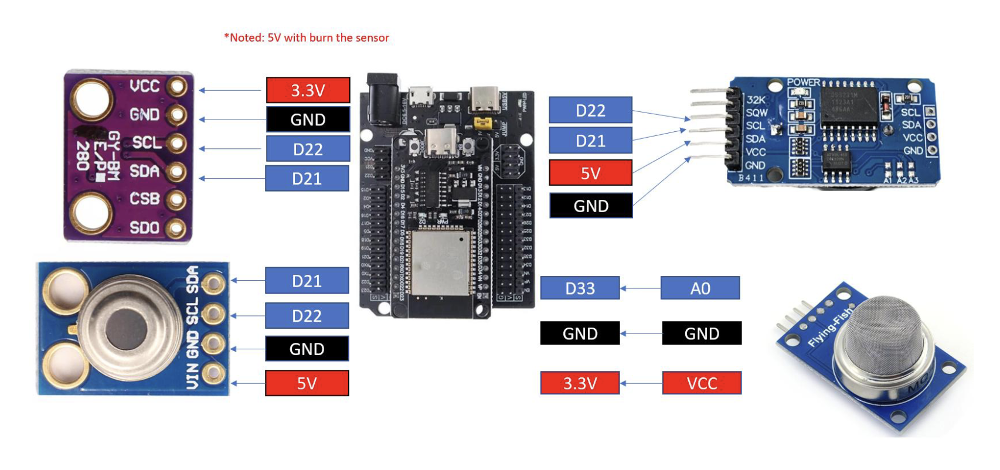
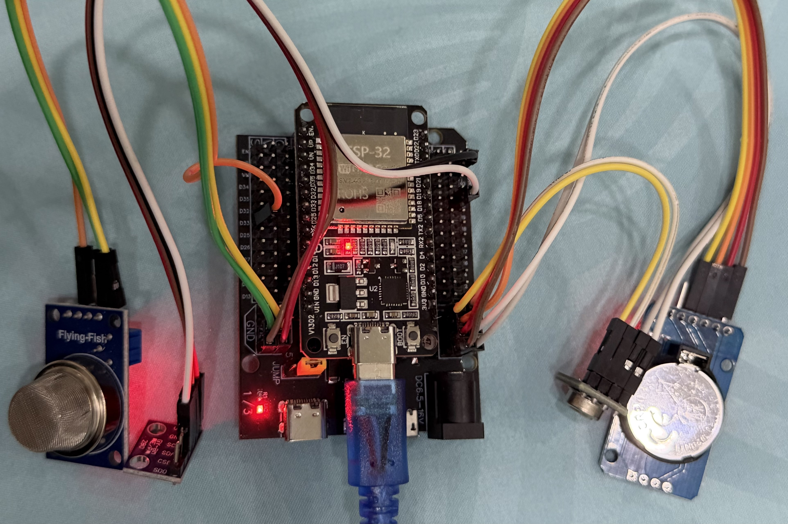
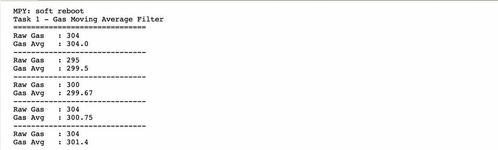
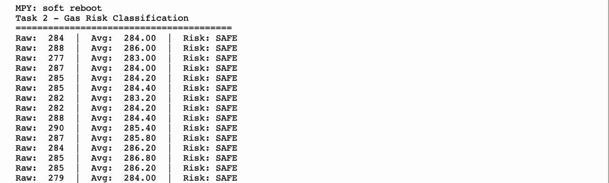
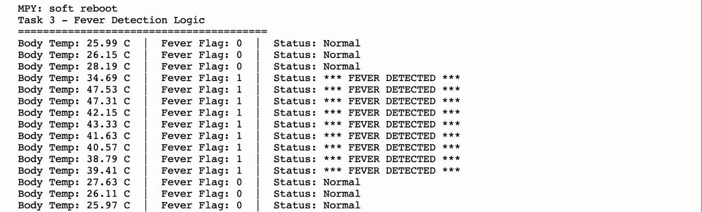
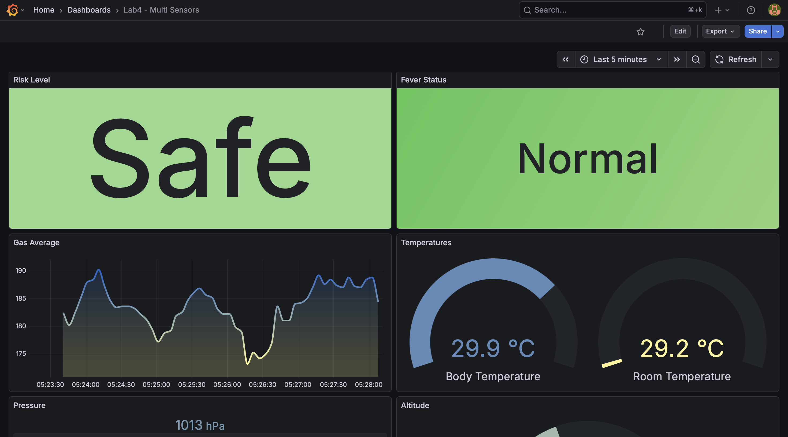
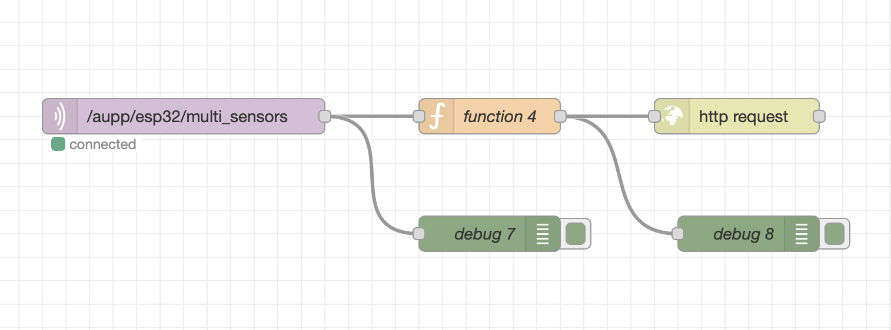
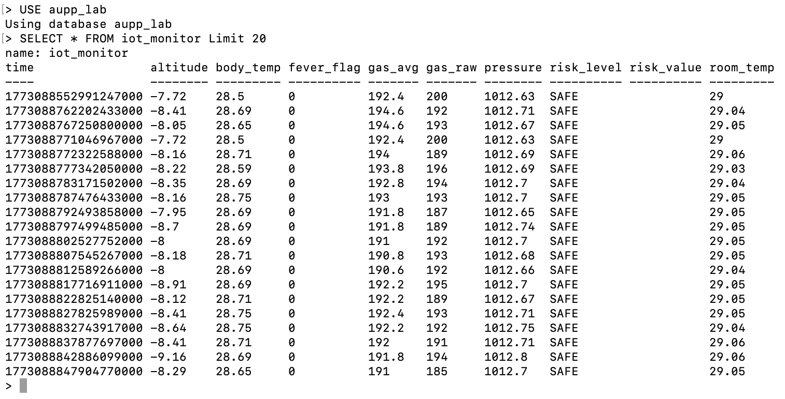
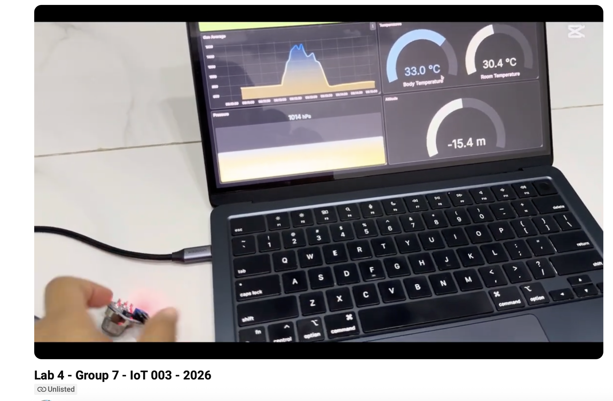

# LAB4_Multi_Sensor_IoT_Grafana

## System Overview

This project builds a multi-sensor IoT monitoring system using ESP32 with MicroPython.  
Sensor data is processed on the ESP32 and sent to Node-RED, stored in InfluxDB, and visualized using Grafana.

Sensors used:

- MLX90614 – Body temperature
- MQ-5 – Gas detection
- BMP280 – Pressure and altitude
- DS3231 – Real-time clock (timestamp)

## Wiring




### System Architecture

```
Sensors → ESP32 (Edge Processing) → Node-RED → InfluxDB → Grafana
```

Sensors → ESP32 (Edge Processing) → Node-RED → InfluxDB → Grafana

ESP32 reads sensor values, processes the data, and sends it to Node-RED for storage and visualization.

## Code Setup

This project uses library code:

- bmp280.py
- ds3231.py
- mlx90614.py

## Task 1 – Gas Filtering (Moving Average)

- Read MQ-5 using ESP32 ADC (12-bit).
- Store the last 5 readings.
- Compute moving average.
- Print raw and averaged value.
- Send averaged value to Node-RED

Formula:

Gas Average = (V1 + V2 + V3 + V4 + V5) / 5

The raw value and averaged value are printed in the Serial Monitor.



## Task 2 – Gas Risk Classification

Gas levels are classified into three states.

| Gas Value | Status  |
| --------- | ------- |
| <2100     | SAFE    |
| 2100–2599 | WARNING |
| ≥2600     | DANGER  |

The risk level is included in the data packet sent to Node-RED.



---

## Task 3 – Fever Detection

Body temperature from MLX90614 is used to detect fever.

- If body_temp ≥ 32.5°C → fever_flag = 1 , Status: Fever deteced
- Else → fever_flag = 0 , status: Normal



---

## Task 4 – Pressure and Altitude Monitoring

BMP280 provides:

- Pressure (hPa)
- Altitude (meters)

These values are sent to Node-RED and displayed in Grafana.

Grafana panels:

1. Gas Average (Time Series)
2. Risk Level
3. Body Temperature Gauge
4. Pressure Graph
5. Altitude Graph



## Flowchart


## Node-RED flow



## Screenshot of InfluxDB data



## Demo video


[Link to demo video](https://youtu.be/uZ0yxigEDpU?si=wS-dwX0jW8T1dfGu)
