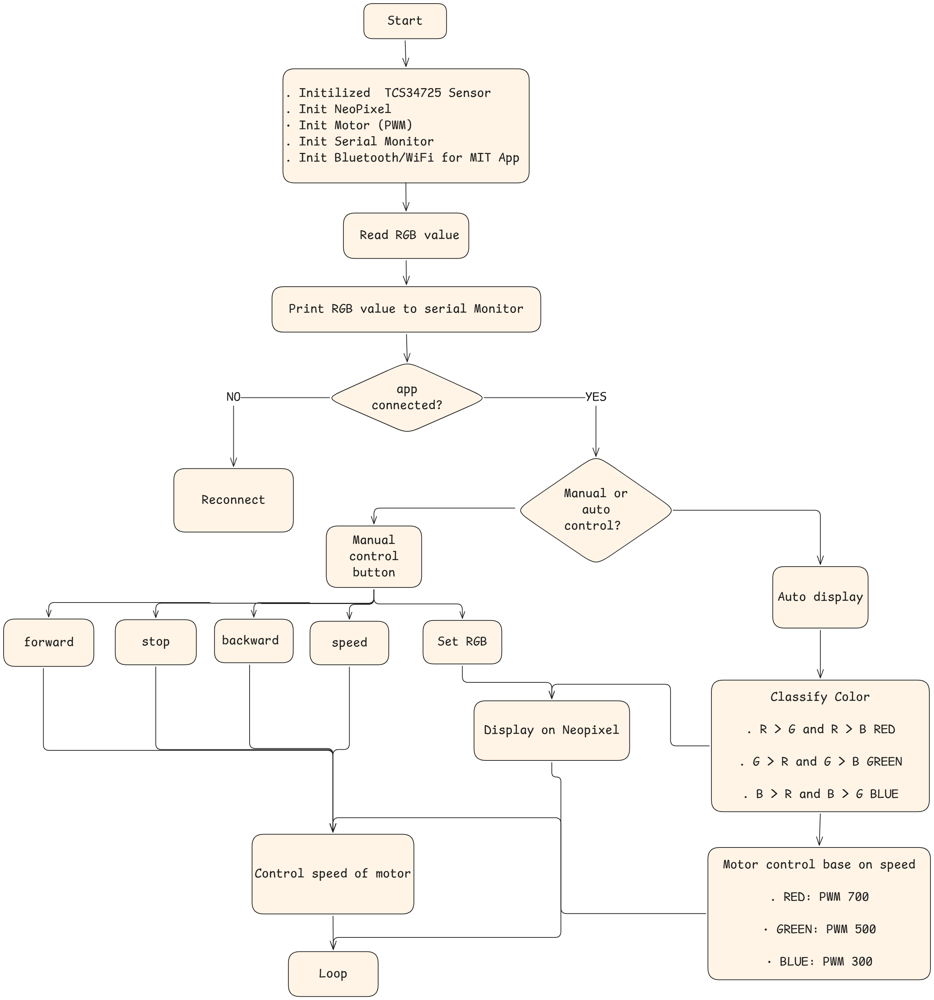
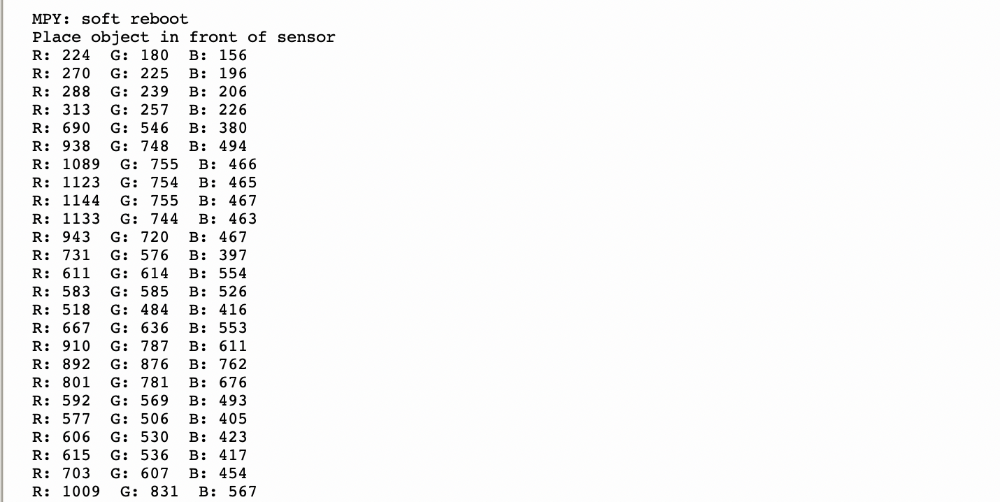

# LAB5*Smart_Color_Detection*&\_Control_with_MIT_App

## Wiring

## Setup Instructions

1. Install MicroPython on ESP32
2. Upload `tcs34725.py` library to ESP32
3. Upload `main.py` to ESP32
4. Update WiFi `ssid` and `password` in `main.py`
5. Run `main.py` in Thonny
6. Connect phone to same WiFi
7. Enter ESP32 IP in MIT App

## Flowchart

## System Logic

The ESP32 continuously reads RGB values from the TCS34725 sensor and classifies the color (RED, GREEN, BLUE) using rule-based logic (R>G and R>B = RED, etc).

In auto mode, the NeoPixel displays the detected color and the motor speed is set automatically (RED=700, GREEN=500, BLUE=300 PWM).

The MIT App connects via WiFi, allowing manual override of the motor direction and NeoPixel color using buttons and sliders. Manual mode times out after 10 seconds and returns to auto mode.

## Task1 - RGB Reading

- Read RGB values from TCS34725.
- Print values to Serial Monitor.

## Task 2 - Color Classification

- Classification Rules:
  - R > G and R > B → RED
  - G > R and G > B → GREEN
  - B > R and B > G → BLUE

[Link to Task 2 demo video](https://www.youtube.com/watch?v=L38auf7_gzo)

## Task 3 - NeoPixel Control

- RED → NeoPixel shows Red
- GREEN → NeoPixel shows Green
- BLUE → NeoPixel shows Blue

[Link to Task 3 demo video](https://www.youtube.com/watch?v=UymnfYKWV-s)

## Task 4 - Motor Control (PWM)

- RED → PWM = 700
- GREEN → PWM = 500
- BLUE → PWM = 300

[Link to Task 4 demo video](https://www.youtube.com/watch?v=8n58xv2gZkQ)

## Task 5 - MIT App Integration

- App Requirements:
  - Display detected color (Label).
  - Buttons: Forward, Stop, Backward.
  - RGB input boxes (R, G, B).
  - Button to set NeoPixel color manually.

[Link to Task 5 demo video](https://www.youtube.com/watch?v=BKO6mPDrH8c)
