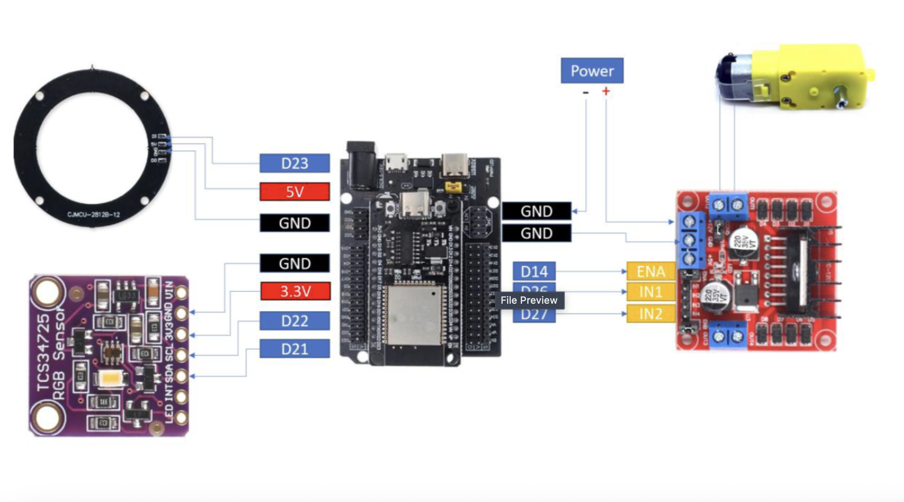
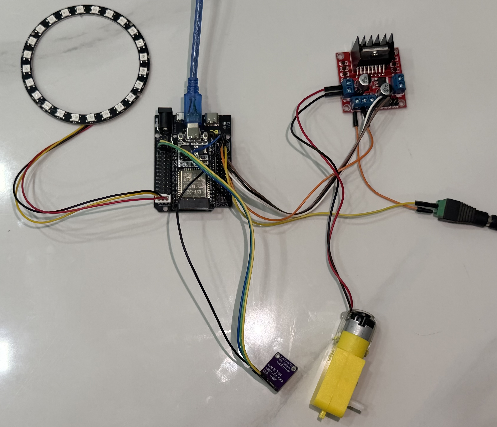
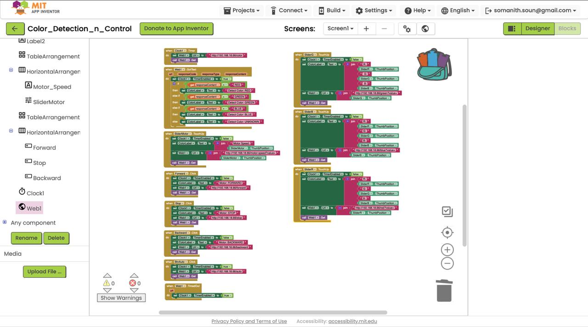
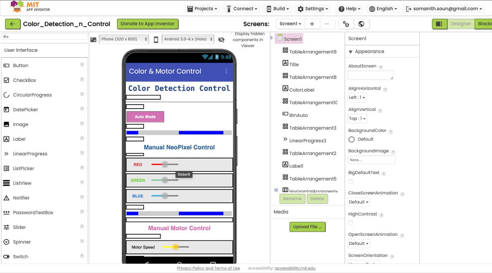

# LAB5_Smart_Color_Detection_&_Control_with_MIT_App

## Wiring

## Setup Instructions

## Task1 - RGB Reading
- Read RGB values from TCS34725.
- Print values to Serial Monitor.

## Task 2 - Color Classification
- Classification Rules:
    - R > G and R > B → RED
    - G > R and G > B → GREEN
    - B > R and B > G → BLUE

[Link to Task 2 demo video](https://www.youtube.com/watch?v=L38auf7_gzo)

## Task 3 - NeoPixel Control
- RED → NeoPixel shows Red
- GREEN → NeoPixel shows Green
- BLUE → NeoPixel shows Blue

[Link to Task 3 demo video](youtube.com/watch?v=UymnfYKWV-s&feature=youtu.be)

## Task 4 - Motor Control (PWM)
- RED → PWM = 700
- GREEN → PWM = 500
- BLUE → PWM = 300

[Link to Task 4 demo video](https://www.youtube.com/watch?v=8n58xv2gZkQ)

## Task 5 - MIT App Integration
- App Requirements:
    - Display detected color (Label).
    - Buttons: Forward, Stop, Backward.
    - RGB input boxes (R, G, B).
    - Button to set NeoPixel color manually.

## Diagram

