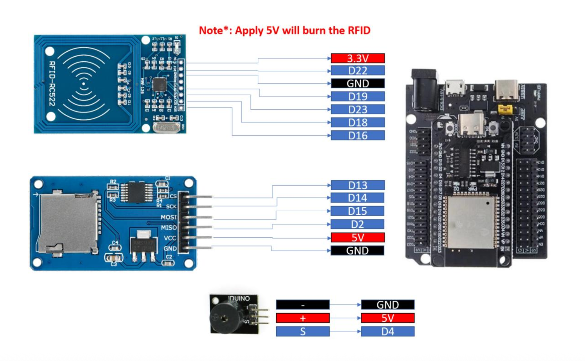
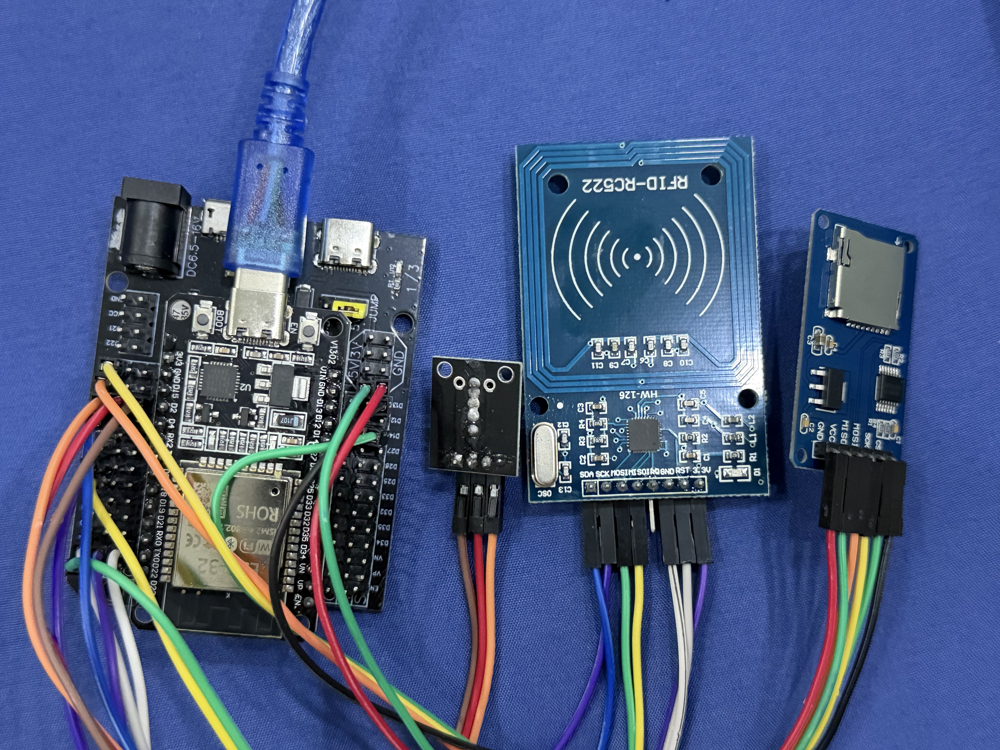
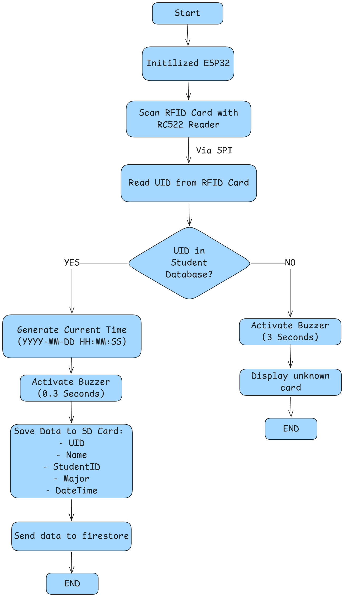
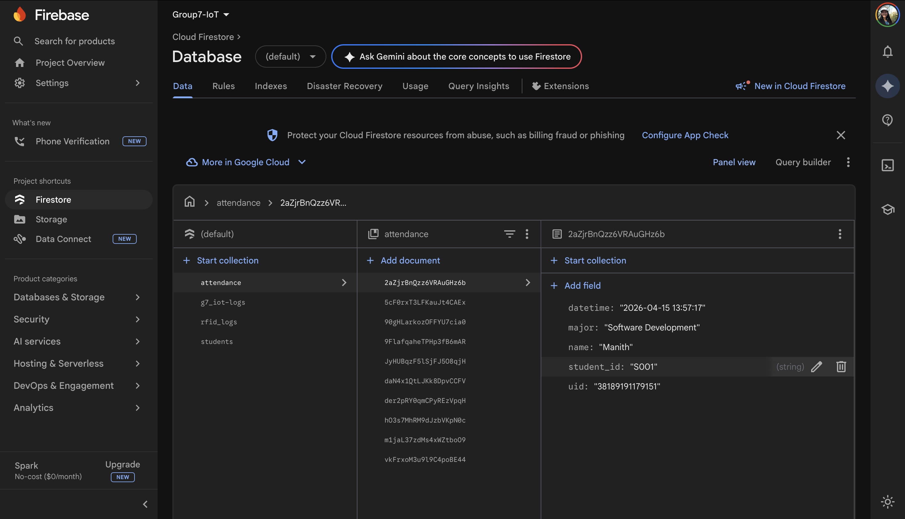
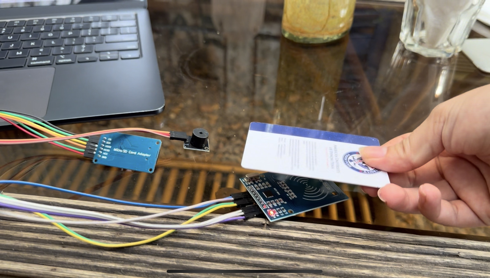

# LAB6_RFID_System

## Wiring

## Setup Instructions

1. Install MicroPython on ESP32

2. Upload mfrc522.py and sdcard.py libraries to ESP32

3. Update WiFi ssid, password, and Firestore credentials in main.py

4. Format SD card to FAT32 and insert it into the SD module

5. Run main.py in Thonny

6. Swipe RFID card to check for UID detection and database matching

## Flowchart

## Firestore

## Student Database

Student records are stored in Firestore under the `students` collection.
The ESP32 fetches the database on boot via the Firestore REST API.
Each student document contains: uid, name, student_id, major.

## Tasks

1. Read UID from RFID card

- Detect card and retrieve its unique ID (UID)

2. Match UID with student database

- Compare UID with predefined data
- If found ->valid student
- If not -> unknown card

3. Generate current datetime

- Format:
  YYYY-MM-DD HH:MM:SS

4. If UID is valid:

- Activate buzzer for 0.3 seconds
- Save data to SD card (CSV format):
  UID, Name, StudentID, Major, DateTime
- Send data to Firestore

5. If UID is invalid:

- Activate buzzer for 3 seconds
- Display: "Unknown Card"
- Do not save or send data

## Demo Video

[Link to Demo Video](https://youtu.be/uJR8jpINzU0?si=oj_9tFW4Jr0dzRq5)
