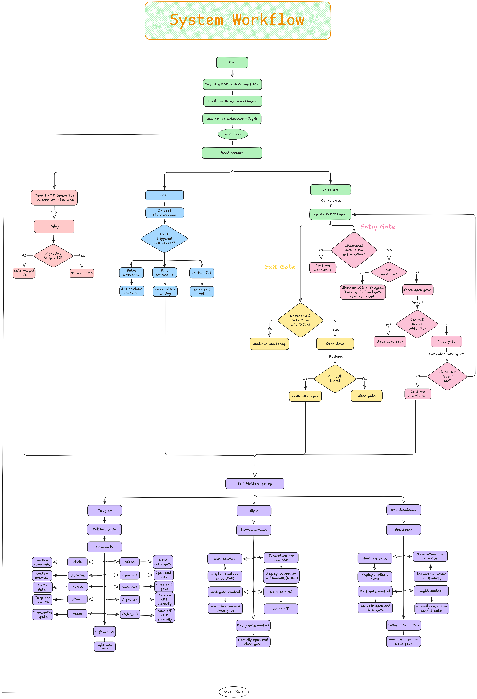

# Bloom Lot-Smart IoT Parking

## Introduction

With the increasing number of vehicles, managing parking spaces efficiently has become a challenge. Traditional parking systems often rely on manual monitoring, which can lead to congestion and difficulty in finding available parking slots.

Bloom Lot is a smart IoT-based parking system designed to improve parking management and convenience. The system uses sensors and an ESP32 microcontroller to detect vehicle presence, monitor parking slot availability, and control the parking gate automatically. It also allows users to check system status and control certain functions through platforms such as a web dashboard, Blynk application, and Telegram bot. The goal of Bloom Lot is to provide a more efficient, automated, and user-friendly parking solution using IoT technology.

---

## Hardware description

| Component           | Amount | Role & Description                                           | 
| ------------------- | ------ | ------------------------------------------------------------ |
| ESP32 (MicroPython) | 1      | Main microcontroller, it runs all logic, WiFi, IoT Platforms |
| Ultrssonic          | 2      | Detects vehicles at entry and exit points                    |
| IR Sensor           | 4      | Detects occupancy of each individual parking slot            |
| Servo Motor         | 2      | Control entry and exit gate barrier arms                     |
| DHT11               | 1      | Measures ambient temperature and humidity                    |
| Relay Module        | 1      | Switches main parking area lights on/off                     |
| LED                 | 1      | Visual status indicator on the ESP32 board                   |
| TM1637 Display      | 1      | 4-digit 7-segment display showing available slot count       |
| LCD I2C             | 1      | Two-line display showing gate status and system messages     |

## Hardware Configuration

| component | Signal | GPIO |
| --------- | ------ | ---- |
| Ultrasonic 1 (entry) | TRIG | GPIO5 | 
| Ultrasonic 1 (entry) | ECHO | GPIO18 | 
| Ultrasonic 1 (exit) | TRIG | GPIO19 |
| Ultrasonic 1 (exit) | ECHO | GPIO23 |
| IP Sensor 1 | OUT | GPIO34 |
| IP Sensor 2 | OUT | GPIO35 |
| IP Sensor 3 | OUT | GPIO36 |
| IP Sensor 4 | OUT | GPIO39 |
| Servo entry | SIGNAL | GPIO13 |
| Servo Exit | SIGNAL | GPIO12 |
| DHT11 | DATA | GPIO4 |
| Relay Module | IN | GPIO26 |
| LED | SIGNAL | GPIO2 |
| TM1637 | CLK | GPIO14 |
| TM1637 | DIO | GPIO27 |
| LCD I2C | SDA | GPIO21 |
| LCD 12C | SCL | GPIO22 |
---

## System Architecture

Bloom Lot’s System is divided into three main parts: Input Layer, Processing Layer, and Output and Communication Layer. The Esp32 acts as the central controller that receives and sends data from input Layer to Processing units and output module.

### 1. Input layer

The input Layer consists of sensors that collect real time data from the parking environment and transmit the information to the esp32 minicontroller for processing.

- Ultrasonic Sensors: The project used 2 ultra sonic Sensors to detect cars approaching the entry and exit gates and send distance data to ESP32 to trigger gate operations.
- IR Sensors: 4 IR sensors are used to monitor occupancy status of each parking slot and provide signal indication whether how many slots are occupied and how many available.
- DHT11 Sensor:​ Measures temperature and humanity of the parking area and sends data to ESP32 for monitoring.

### 2. Processing Layer

The processing layer of this project is mainly handled by ESP32 minicontroller, which acts as the central controller of the system.

- Data Processing: ESP32 receives input data from ultra sonic, IR sensors and DHT11 and analyses slot availability in the parking lot. The system status is updated based on the latest sensor readings.
- System decision control: Based on the processed data, The ESP32 determined whether the gate should be opened or closed. Meaning after receiving the ultrasonic data it sends a control signal to the servo motors to operate the parking gates.
- System output and communication: The ESP32 updates the TM1637 display and LCD screen with real time parking information. Through WIFI, the ESP32 sends system data to external platforms such as the telegram bot, web dashboard and Blynk application for remote monitoring and control.

### 3. Output and Communication Layer

This layer consists of output devices and IOT platforms that receive commands or data from the ESP32.

- Servo Motors: receive signal from the ESP32 when there's a car approaching ultrasonic.
- TM1637 Display: After the ESP32 read and received data from all 4 IR sensors it sent the data to TM1637 to display the number of slots available.
- LCD I2C Display: This is an output device used to show status of the whole parking space whether there's a slot available and both gate status.
- Relay Module and LED lights: receive data from ESP32 through DHT11 and turn on LED when night comes.
- IOT platform: Consist of three main platforms such as Telegram chat bot, Web dashboard and Blynk app which all receive data and send data communicating back and forth with the ESP32.
---

## Software Architecture

The Smart IoT Parking System software is written in MicroPython for ESP32 and organized into multiple program modules. Each module handles a specific task such as sensor reading, system logic, communication, and device control.

### 1. Sensor Processing Module

This module handles reading and processing raw sensor data.

#### Main Function:

- `measure_distance()`: Calculate and measure distance between car and ultra sonic.
- `get_entry_distance()`: get the distance from car to ultrasonic 1 make sure there's a car approaching entry.
- `get_exit_distance()`: get the distance from car to ultrasonic 2 make sure there's a car approaching exit.
- `get_slot_status()` : Determines whether each parking slot is occupied or free using an IR sensor.
- `get_available_slot()`: Count total available slot from slot status.
- `read_dht()`: Reads temperature and humidity from the DHT11 sensor

### 2. Gate Control Module

This module controls the opening and closing of parking gates.

#### Main function:

- `Set_servor1()`: Sets the angle of the entry gate servo motor
- `Set_servor2()`: Sets the angle of the exit gate servo motor
- `open_entry_gate()` and `close_entry_gate()`: Open and Closes the entry gate by resetting the entry servo motor position.
- `Open_exit_gate()` and `close_exit_gate()`: Opens the exit gate when a vehicle is detected leaving the parking area and closes when vehicle has exited.

### 3. Display Management Module

Function responsible for updating local display devices.

#### Main function:

- `update_tm1637()`: Updates the TM1637 display to show the number of available parking slots.
- `update_lcd()`: updates the LCD screen with system status message and available slots.

### 4. LED control module

Function responsible controlling the LED.

#### Main function:

- `light_on()`: Activates relay turn on the parking LED.
- `light_off()`: Deactivate the relay to turn off the parking LED.
- `get_light_status()`: return the current status of LED.

### 5. Telegram Communication Module

Functions responsible for communicating with the Telegram bot.

#### Main Function:

- `tg_request()`: Sends HTTP requests to the Telegram Bot API server
- `tg_send()`: Sends system messages or notifications to the Telegram chat.
- `tg_get_updates()`: Retrieves new messages or commands from the Telegram bot.
- `tg_handle()`: Processes Telegram commands and performs corresponding system actions.
- `tg_poll()`: Periodically checks for new Telegram commands.

### 6. Web Dashboard Module

Functions responsible for handling the web-based monitoring interface.

#### Main Function:

- `get_html()`: Generates the HTML page used for the parking system dashboard.
- `Web_handle()`:Processes HTTP requests and performs actions triggered from the web interface.
- `Create_web_server()`: Starts a web server on the ESP32 for dashboard access.

### 7. Blynk Communication Module:

Functions responsible for communicating with the Blynk IoT platform.

#### Main function:

- `Blynk_connect()`: Establishes a connection between the ESP32 and the Blynk server.
- `blynk_write()`:Sends sensor and system data to Blynk virtual pins.
- `blynk_run()`:Handles incoming commands from the Blynk application.

---

## IoT Integration

The Smart IoT Parking System integrates multiple IoT platforms to enable remote monitoring, control, and real-time data access. The ESP32 microcontroller connects to the internet through WiFi and communicates with external services such as Telegram Bot, Web Dashboard, and Blynk Mobile Application.

### 1. WIFI connectivity

The ESP32 connects to a wireless network using the `connect_wifi()` function.This connection enables the system to communicate with external IoT platforms. Once connected, the ESP32 obtains an IP address that allows users to access the web dashboard.

### 2. Telegram Bot Integration

Telegram bot is one of the IoT systems integrated into smart car parking systems. This allows Telegram bot remote interaction through chat commands:

- `status`: Displays system status including gates, lights, and slot availability.
- `/slots`: Shows the number of available parking slots.
- `/temp`: Displays temperature and humidity readings.
- `/open` and `/close`: manually control entry gate.
- `/open_exit and /close_exit`: manually control exit gate.
- `/light_on` and `/light_off` : Control parking LED
- `/light_auto`: turn on auto mode for led to turn on when temperature below 28 celcius.

  #### Communication Method of Telegram bot:

- The ESP32 communicates with the Telegram Bot using the Telegram Bot API over HTTPS requests.
- The bot token used for authentication is generated using BotFather.
- The Telegram Chat ID, required for sending and receiving messages, is obtained using Get My ID Bot.
- Functions such as `tg_send()`, `tg_update()` and `tg_poll()` handle message transmission and command retrieval between the ESP32 and the Telegram bot.

### 3. Web Dashboard Integration

The ESP32 hosts a local web server that provides a real-time parking management dashboard. The web dashboard allows user to monitor and control over important features such as:

- Available parking slots
- Temperature and humidity
- Entry and exit gate status
- Parking light status
- Manually control entry and exit gate
- Manually control over parking LED

  #### Communication method:

- Use the HTTP protocol
- The web server runs on port 80 and can be accessed through the ESP32 IP address in a browser.

### 4. Blynk application integration

The system also connects to the Blynk IoT platform for mobile monitoring and control over features:

- Displays real-time system data of Temperature and Available parking slots
- Allows users to remotely control Entry gate and Exit gate

  #### Communication Method:

- Uses the Blynk TCP protocol through virtual pins.
- Functions such as `blynk_connect()` and `blynk_write()` manage communication between ESP32 and the Blynk server.

---

## Working Process Explanation

The Smart IoT Parking System operates through a coordinated interaction between sensors, the ESP32 microcontroller, output devices, and IoT platforms. The system continuously monitors the parking environment and automatically controls gate operations and parking information displays.

### Step 1: System Initialization

When the system starts, the ESP32 initializes all sensors, output devices, and communication modules. It connects to the WiFi network using the `connect_wifi()` function, which allows communication with external platforms such as Telegram, Blynk, and the Web Dashboard. All displays and devices are reset to their default state.

### Step 2: Vehicle Detection at Entry Gate

The ultrasonic sensor installed at the entry gate continuously measures the distance between the sensor and approaching vehicles using the `get_entry_distance()` function.
When a vehicle is detected within a predefined distance threshold and parking slots are available, the ESP32 sends a signal to the entry servo motor to open the gate using the `open_entry_gate()` function.

### Step 3: Parking Slot Detection

Each parking slot is monitored by an IR sensor. The function `get_slot_status()` reads the signals from the IR sensors to determine whether a slot is occupied or free.
The ESP32 processes the signals from all four sensors and calculates the number of available slots using the `get_available_slot()` function. This information is then displayed on the TM1637 display and the LCD screen.

### Step 4: Vehicle Entry and Gate Closure

After the vehicle passes through the entry gate, the ESP32 closes the gate using the `close_entry_gate()` function. The system then updates the parking slot status based on the IR sensor readings.

### Step 5: Vehicle Exit Detection

When a vehicle approaches the exit gate, the second ultrasonic sensor measures the distance using the `get_exit_distance()` function. If a vehicle is detected leaving the parking area, the ESP32 triggers the exit servo motor to open the exit gate using `open_exit_gate()`.
After the vehicle exits, the exit gate is closed automatically using `close_exit_gate()`.

### Step 6: Display Updates

The system continuously updates local displays:

- The TM1637 display shows the number of available parking slots.
- The LCD I2C display shows system messages such as gate status, parking availability, and system notifications.

### Step 7: Environmental Monitoring and Lighting

The DHT11 sensor measures the temperature and humidity of the parking area using the `read_dht()` function. Based on environmental conditions, the relay module can activate or deactivate parking lights using the `light_on()` and `light_off()` functions.

### Step 8: IoT Communication

The ESP32 sends real-time system data to external IoT platforms:

- Telegram Bot provides remote monitoring and command control.
- Web Dashboard allows users to monitor and control the parking system through a browser.
- Blynk Application enables mobile monitoring and remote gate control.
  Users can also manually control the system through commands such as opening gates, checking slot availability, or controlling parking lights.

## System diagrams

### System Architecture

### System Workflow

---

## Challenges Faced

### 1. Multi-Platform Synchronization

One of the primary challenges was managing simultaneous communication between Telegram, Blynk, and the Web Dashboard was challenging due to the ESP32's limited memory. Running Blynk HTTP requests immediately before Telegram HTTPS requests caused SSL handshake failures, preventing messages from being delivered. This was resolved by staggering platform intervals, adding garbage collection before each network call, and separating Blynk button reads from data updates into independent timers.

### 2. System Design and Implementation

Another challenge was designing and building the physical parking structure. Since this was a new concept for the team, considerable time was required to understand how to properly place sensors, gates, and other hardware components to ensure accurate detection and smooth system operation.

### 3. Sensor Accuracy and Calibration

Sensor calibration was also a challenge during system development. Ultrasonic sensors required proper positioning and distance threshold to accurately detect vehicles. Similarly, IR sensors had to be adjusted to ensure that they can correctly detect the presence or absence of vehicles in the parking slots.

### 4. Network Connectivity

Stable WiFi connectivity was important for IoT communication. Temporary network interruptions could delay data transmission between the ESP 32 and external platforms, which required implementing reliable connection handling in the software.

---

## Future Improvements

### 1. Expansion of Parking Slots

As a future improvement, the system can be expanded to support more parking slots. Additional IR sensors can be added to monitor more spaces, and the system logic can be updated to handle larger parking areas.

### 2. Mobile Application Development

A mobile application could be developed to provide a more user-friendly interface for monitoring parking availability and controlling gates, instead of relying solely on third-party platforms.

### 3. Automatic Lighting System

The lighting system can be improved by integrating a light sensor to automatically control parking lights based on environmental brightness rather than relying only on manual commands.

### 4. License Plate Recognition

The integration of camera and license plate recognition system can be another improvement. This would allow automatic vehicle identification and improve parking security.

### 5. Cloud Data Storage

Future versions of the system could store parking data in cloud database to allow long-term data analysis, such as parking usage statistics and peak parking hours.

---

## Conclusion

In conclusion, the **Bloom Lot Smart IoT Parking System** demonstrates how IoT technology can improve parking management through automation and real-time monitoring. By integrating sensors, the ESP32 microcontroller, and IoT platforms such as Telegram, Web Dashboard, and Blynk, the system can detect vehicles, monitor parking slots, and control gates efficiently.

Overall, the project shows how hardware, software, and IoT communication can work together to create a smart and convenient parking solution, with potential for further improvements in the future.

---

## Video Presentation

[Link to video presentation](https://youtu.be/Hbwmx_uMP88)
